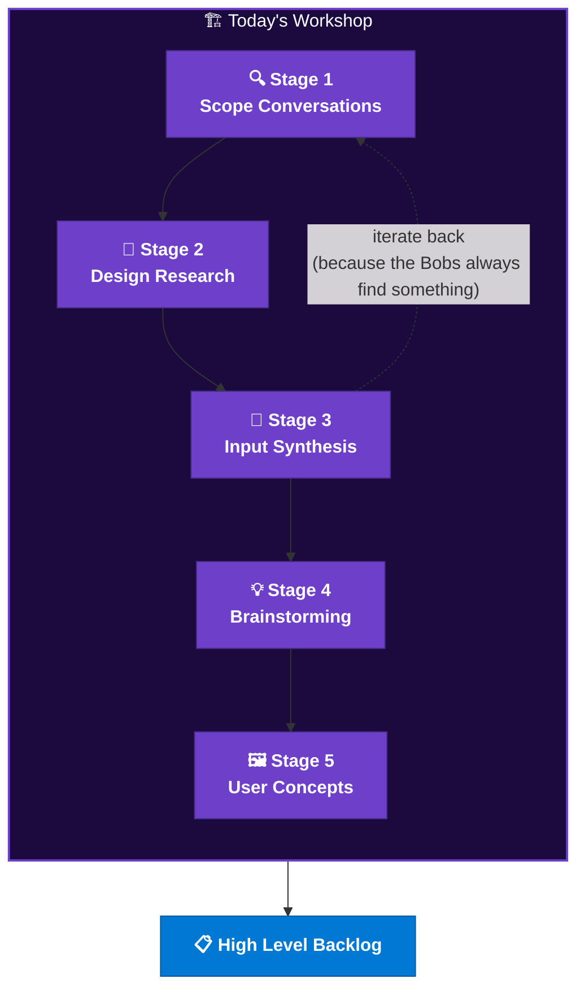

<div align="center">

<br/><br/>
<h1>🖨️ ApprovFlo Pro™ 🖨️</h1>
<h3><em>"A Modern Approval System That Does Not Make You Want to Beat a Printer with a Baseball Bat"</em></h3>
<h4>Powered by AI &nbsp;·&nbsp; Built on GitHub &nbsp;·&nbsp; Inspired by Many Questions</h4>

<br/>


<br/><br/>

> **"Our approval process is killing us. It takes too long, too many people are involved, and things fall through the cracks. We need a modern system to replace what we have. Can you build it?"**
>
> *— VP of Operations, Initech Corp.*

</div>

---

## 📋 Did You Get That Memo?

Somewhere between the 4th approval escalation and the third "Reply All" from someone in a department that has never met you, it became clear: **the approval process at Initech is broken.**

<div align="center">


<br/>
</div>

Nobody knows who actually approves what. Bob in Accounting swears it goes through Joanna. Joanna says it needs a cover sheet. The cover sheet template lives on a shared drive that was last touched in 2009. And Milton — **nobody told Milton anything** — which is how three expense reports went missing and an entire floor nearly got moved to storage.

**ApprovFlo Pro™** is the system we are *planning* today. Using AI-powered design thinking and GitHub Copilot agents, we are going to go from *one VP's vague cry for help* to a *fully validated solution concept with a clear path to build* — in about 60 minutes. The actual building is a problem for Future Us. Future Us always gets the hard part.

---

## 🏢 The Problem (In Plain Initech English)

<div align="center">

<br/><em>Actual footage of the current approval process.</em>
</div>

<br/>

The VP's request sounds like a solution. It is not. It is a symptom. Here is what is actually going on:

| What They Said | What They Meant |
|:---|:---|
| "Build us a modern system" | "Please make the pain stop" |
| "Too many people are involved" | "Literally no one knows who owns this" |
| "Things fall through the cracks" | "Milton's expense report has been pending since Q2 of last fiscal year" |
| "Our approval process is killing us" | "We have at least 4 separate approval processes and they all suck differently" |

<br/>

> *Yeah, I'm gonna need you to go ahead and come in on Saturday to scope this properly. That would be great.*

---

## 🧠 How We Got Here

We did not just fire up a code editor and start naming things. We went through **5 stages of the HVE Design Thinking framework**, facilitated by a GitHub Copilot AI agent, stopping exactly where we should — before anyone writes a line of code they will have to rewrite.



<details>
<summary><strong>Stage 1 — Scope Conversations</strong> &nbsp;<em>(a.k.a. "What Do You Actually Want?")</em></summary>
<br/>

We classified the VP's request as a **Frozen Request** — specific-sounding but symptom-wrapped. Then we interrogated it. Gently. Like a performance review you did not see coming.

The agent generated discovery questions organized by category and mapped stakeholder personas across the full power/interest spectrum. Turns out there are at least four different approval processes running in parallel. Nobody told anyone else they existed.

</details>

<details>
<summary><strong>Stage 2 — Design Research</strong> &nbsp;<em>(a.k.a. "Talk to the People")</em></summary>
<br/>

We simulated stakeholder interviews across 6 personas: the VP who made the request, the end user who processes approvals daily, the IT gatekeeper who watches over integrations like Milton watches over the kitchen, the compliance officer who added three more fields to every form, the reluctant middle manager who forwards everything without reading it, and Milton.

Milton had a lot to say.

</details>

<details>
<summary><strong>Stage 3 — Input Synthesis</strong> &nbsp;<em>(a.k.a. "Connect the Dots Before Someone Builds the Wrong Thing")</em></summary>
<br/>

Cross-referenced every interview. Surfaced the actual problem underneath the request.

Spoiler: it was not a technology gap. It was a process ownership gap that technology was being asked to paper over, like a TPS cover sheet on a form that should have been deleted years ago.

</details>

<details>
<summary><strong>Stage 4 — Brainstorming</strong> &nbsp;<em>(a.k.a. "Yes, And...")</em></summary>
<br/>

Generated 15+ ideas. Some excellent. Some unhinged. All documented. The unhinged ones were filtered out after the *"what if we just emailed everything to a Slack bot and called it a workflow"* suggestion gained too much traction.

Four themes emerged: **Visibility and Ownership**, **Intelligent Routing**, **Audit and Compliance**, and **Self-Service Requests**. These became our feature buckets.

</details>

<details>
<summary><strong>Stage 5 — User Concepts</strong> &nbsp;<em>(a.k.a. "Napkin Sketches, But Make Them Intentional")</em></summary>
<br/>

Quick visual concepts per solution theme. Validated with stakeholders before anyone wrote a single line of code. Revolutionary concept that somehow still surprises people.

</details>

> **Stages 6–9 (Lo-Fi Prototypes → Hi-Fi Prototypes → User Testing → Full Backlog)** are the next chapter — and yes, Milton is already listed as an owner on three issues. He does not know yet.

<div align="center">

<br/>
</div>

<br/>

---

## 🗂️ Repository Structure

```plaintext
fluffyturtle/
├── README.md                            ← you are here
├── .github/
│   ├── ISSUE_TEMPLATE/                  ← Issue templates with DT traceability fields
│   ├── agents/                          ← Copilot agent definitions (system prompts, tools, variables)
│   ├── instructions/                    ← Scoped instruction files applied via applyTo glob
│   ├── prompts/                         ← Reusable slash-command prompts
│   ├── skills/
│   │   ├── docx-to-markdown/            ← Convert .docx to clean markdown using pandoc
│   │   └── gh-issue-management/         ← Create, link, and manage GitHub issues via gh CLI
│   └── copilot-instructions.md          ← Global Copilot instructions for the repo
├── .vscode/                             ← VS Code workspace settings
└── docs/
    ├── .assets/
    │   └── gifs/                        ← README images and animations
    ├── design-thinking/
    │   ├── context/                     ← Active DT session state (agents read this first)
    │   ├── interview-questions/         ← Generated per persona (including Milton's)
    │   ├── meeting-agendas/             ← Stage-by-stage facilitation guides
    │   └── meeting-transcripts/         ← Simulated SME interview outputs
    └── project/                         ← Engagement lifecycle artifacts and assessments
```

> *Yes, the repo is called `fluffyturtle`. No, we are not going to talk about it.*

---

## 🚀 Getting Started

### Prerequisites

- GitHub account (free tier is fine; we are professionals here, not animals)
- GitHub Copilot with Agent mode access
- `gh` CLI installed and authenticated — run `gh auth status` to confirm
- A healthy skepticism of approval processes
- At least 15 pieces of flair *(Joanna says 37 is the right number if you actually care)*

---

## 🤝 Contributing

<div align="center">

</div>

<br/>

Pull requests are welcome. Per current policy, they require approval from:

- [ ] Your direct manager
- [ ] Your manager's manager
- [ ] Someone in Legal (unclear which Legal)
- [ ] The person who owns the cover sheet template *(location: unknown)*
- [ ] Milton *(he cc's himself on everything anyway, might as well make it official)*

We are building a system to fix this. Please stand by.

> *So if you could just go ahead and make sure you do that from now on, that would be great. That would be great.*

---

## 📜 License

This project is licensed under the **"I Would Not Say I've Been Missing Work"** Public License (IWWSIBMW-1.0).

You are free to use, copy, modify, and distribute this software, provided that you:
1. Do not build another approval process to govern contributions to this approval-process project
2. Acknowledge that Milton was here first
3. Remember to put a cover sheet on your TPS reports

---

<div align="center">


<br/><br/>
<em>Planned with 💙 by people who have definitely never had a case of the Mondays.</em>
<br/><br/>


</div>
