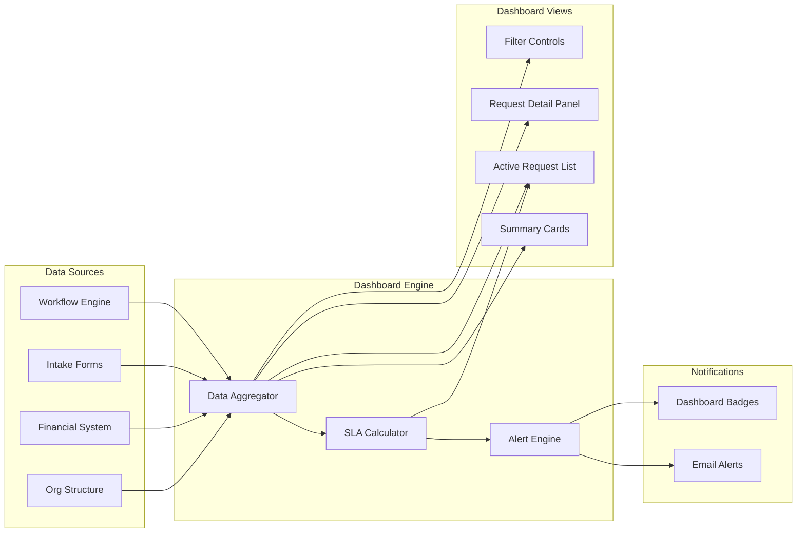

# Issue #28: Real-Time Approval Status Dashboard Design

**Author:** Dallas (Process Designer)
**Date:** 2026-03-02
**Status:** Draft for squad review
**Epic:** 10 — Dashboard
**Initiative:** 1 — Clear the Path

---

## 1. Purpose

Lumbergh's informal "loop me in" gate added 1–2 days to every request over $5K. The process design (01-process-design.md, Section 4) replaces that blocking step with a read-only dashboard. This document defines what that dashboard looks like, what data it surfaces, how it handles SLA visibility, and how it fits into the current platform.

Lumbergh said it plainly: "I want a dashboard that shows me where everything is, who's holding the bag, and how long it's been sitting there." This design delivers that without putting him back in the approval chain.

---

## 2. Dashboard Layout

### 2.1 Wireframe

```
┌──────────────────────────────────────────────────────────────────────────┐
│  APPROVAL STATUS DASHBOARD                           [Filters ▼] [⟳]   │
├──────────────────────────────────────────────────────────────────────────┤
│                                                                          │
│  ┌─────────────┐  ┌─────────────┐  ┌─────────────┐  ┌─────────────┐    │
│  │  PENDING     │  │  AVG CYCLE  │  │  OVERDUE    │  │  APPROVED   │    │
│  │     12       │  │   4.2 days  │  │     3       │  │   This Week │    │
│  │  active      │  │  (target 7) │  │  past SLA   │  │     27      │    │
│  └─────────────┘  └─────────────┘  └─────────────┘  └─────────────┘    │
│                                                                          │
├──────────────────────────────────────────────────────────────────────────┤
│  FILTER BAR                                                              │
│  ┌──────────┐ ┌───────────────┐ ┌──────────────┐ ┌─────────────────┐   │
│  │ Amount ▼ │ │ Department ▼  │ │ Req Type ▼   │ │ Age Range ▼     │   │
│  │ All      │ │ All           │ │ All          │ │ All             │   │
│  └──────────┘ └───────────────┘ └──────────────┘ └─────────────────┘   │
├──────────────────────────────────────────────────────────────────────────┤
│                                                                          │
│  ACTIVE REQUESTS                                            Sort by ▼   │
│  ┌────────────────────────────────────────────────────────────────────┐  │
│  │ ●  REQ-2041  Vendor Contract — Initech     $47,200               │  │
│  │    Tier 2: Compliance Review  │ Owner: The Bobs  │ Day 2 of 3    │  │
│  │    SLA: ███████░░░ 67%        │ Dept: Engineering │ ⚠ HIGH VALUE │  │
│  ├────────────────────────────────────────────────────────────────────┤  │
│  │ 🔴 REQ-2038  Software Renewal — Acme       $8,500                │  │
│  │    Tier 1: Budget Verification│ Owner: J. Chen   │ Day 3 of 2    │  │
│  │    SLA: ██████████ OVERDUE    │ Dept: Marketing  │ Auto-escalated│  │
│  ├────────────────────────────────────────────────────────────────────┤  │
│  │ ●  REQ-2043  Office Equipment — Swingline   $1,200               │  │
│  │    Tier 1: Budget Verification│ Owner: M. Davis  │ Day 1 of 2    │  │
│  │    SLA: ████░░░░░░ 40%        │ Dept: Facilities │               │  │
│  ├────────────────────────────────────────────────────────────────────┤  │
│  │ 🟡 REQ-2039  Consulting — TPS Group        $125,000              │  │
│  │    Tier 3: Financial Controls │ Owner: S. Park   │ Day 2 of 2    │  │
│  │    SLA: █████████░ 90%        │ Dept: Operations │ ⚠ HIGH VALUE │  │
│  └────────────────────────────────────────────────────────────────────┘  │
│                                                                          │
├──────────────────────────────────────────────────────────────────────────┤
│  REQUEST DETAIL (click any row to expand)                                │
│  ┌────────────────────────────────────────────────────────────────────┐  │
│  │ REQ-2041: Vendor Contract — Initech                               │  │
│  │                                                                    │  │
│  │ Requestor: Joanna          │ Submitted: 2026-02-28                │  │
│  │ Amount: $47,200            │ Type: Vendor Contract                │  │
│  │ Department: Engineering    │ Vendor: Initech                      │  │
│  │                                                                    │  │
│  │ APPROVAL TRAIL:                                                    │  │
│  │ ✅ Tier 1 Budget Verification — R. Kumar — 2026-02-28 14:30      │  │
│  │    Verified: funds available, budget line ENG-2026-0412           │  │
│  │ ⏳ Tier 2 Compliance Review — The Bobs — assigned 2026-03-01     │  │
│  │    SLA deadline: 2026-03-04                                       │  │
│  │ ○  Tier 3 Financial Controls — pending                            │  │
│  │                                                                    │  │
│  │ Documents: ✅ Justification  ✅ Quote  ✅ COI  ✅ Vendor info    │  │
│  └────────────────────────────────────────────────────────────────────┘  │
│                                                                          │
└──────────────────────────────────────────────────────────────────────────┘
```

### 2.2 Layout Sections

| Section | Purpose |
|---------|---------|
| **Summary Cards** (top row) | At-a-glance health metrics: pending count, average cycle time vs. target, overdue count, weekly throughput |
| **Filter Bar** | Narrow the view by dollar amount range, department, request type, and age. All filters apply to both the active requests list and summary cards |
| **Active Requests List** | Every in-flight request with current tier, assigned owner, elapsed time, SLA progress bar, and status indicators |
| **Request Detail Panel** | Click any row to expand full request data: requestor, amount, documents, and the complete tier-by-tier approval trail with timestamps and reviewer names |

---

## 3. Key Views

### 3.1 All Active Requests

The default view. Shows every request currently in the 3-tier pipeline.

| Column | Data | Source |
|--------|------|--------|
| Request ID | System-generated identifier | Approval platform |
| Description | Short title of the request | Requestor at intake |
| Amount | Dollar value | Intake form |
| Current Tier | Which of the 3 tiers the request is at (Budget, Compliance, Financial Controls) | Workflow engine routing |
| Current Owner | The reviewer assigned at the current tier | Workflow engine assignment |
| Elapsed Time | Business days since the request entered the current tier | Calculated from tier assignment timestamp |
| SLA Progress | Visual bar showing % of tier SLA consumed. Green (0–70%), Yellow (70–90%), Red (90%+/overdue) | Calculated from tier SLA (2/3/2 days) and elapsed time |
| Department | Requesting department | Intake form |
| Request Type | Procurement, budget reallocation, vendor contract, etc. | Intake form |
| Flags | High-value (>$50K), escalated, auto-escalated | System rules |

### 3.2 Filter Controls

All filters are combinable and apply instantly.

| Filter | Options | Behavior |
|--------|---------|----------|
| **Dollar Amount** | Preset ranges: Under $5K, $5K–$25K, $25K–$50K, $50K–$100K, Over $100K, Custom range | Filters the active list and recalculates summary cards |
| **Department** | Dropdown populated from organizational structure | Multi-select enabled |
| **Request Type** | Procurement, Budget Reallocation, Vendor Contract, Software Renewal, Consulting, Other | Multi-select enabled |
| **Age** | Under 2 days, 2–5 days, 5–7 days, Over 7 days (SLA breach territory) | Filters by total elapsed time since intake |

### 3.3 SLA Warning View

Requests are color-coded throughout the dashboard based on SLA status. The filter bar can isolate "approaching" and "overdue" requests specifically.

| Status | Visual | Definition |
|--------|--------|------------|
| **On Track** | Green dot, green progress bar | Under 70% of current tier SLA consumed |
| **Approaching** | Yellow dot, yellow progress bar | 70–90% of current tier SLA consumed |
| **At Risk** | Red dot, red progress bar | 90–100% of current tier SLA consumed |
| **Overdue** | Red dot, red OVERDUE label, row highlighted | Past current tier SLA. Auto-escalation already triggered |

The SLA countdown applies per tier (2 business days for Budget, 3 for Compliance, 2 for Financial Controls), not to end-to-end elapsed time. This matches the SLA enforcement model in the process design.

### 3.4 Summary Statistics

The four cards at the top of the dashboard, always visible.

| Metric | Calculation | Why it matters |
|--------|-------------|----------------|
| **Pending** | Count of requests currently in any tier | Volume awareness. Lumbergh wants to know how much is in the pipe |
| **Avg Cycle Time** | Mean business days from intake gate to final approval, rolling 30-day window | Performance vs. the 7-day target. This is the number Lumbergh reports up the chain |
| **Overdue** | Count of requests past their current tier SLA | Urgency signal. Any number > 0 is a problem |
| **Approved This Week** | Count of requests that completed all 3 tiers in the current business week | Throughput indicator. Shows the system is moving |

---

## 4. Lumbergh's Specific Needs

Each need traced to his interview statements and the process design commitments.

### 4.1 Real-Time Visibility Without Being in the Approval Chain

**What he said:** "I want to see what's moving through the pipeline."
**What he gets:** The active requests list shows every in-flight request. Click any row to see the full detail, including approval trail, documents, and current status. No need to be "looped in." No need to reply-all "Go ahead." The information is always there, updated in real time.

**What he cannot do:** Approve, reject, hold, or reroute any request. The dashboard is read-only. This is not a limitation, it's the design. His informal gate added 1–2 days to every request. The dashboard gives him more visibility than the old "loop me in" pattern without costing the process any time.

### 4.2 High-Value Request Alerts

**What he said:** "Loop me in on everything over five grand." (Later refocused to $50K threshold for high-value alerts.)
**What he gets:**

| Alert | Trigger | Delivery |
|-------|---------|----------|
| High-value entry | Any request >$50K enters the intake queue | Email notification + dashboard badge |
| High-value SLA warning | Any request >$50K reaches 70% of any tier SLA | Email + push notification |
| High-value completion | Any request >$50K completes all tiers | Email with outcome summary |

The $50K threshold can be configured per user role. Lumbergh's threshold is set at $50K based on the process design. He originally asked for $5K, but at $5K he was seeing every mid-size request and creating a bottleneck. The dashboard lets him monitor everything at any dollar level without the alert noise at $5K.

### 4.3 Drill-Down Into Any Request

**What he said:** "I want to see where everything is, who's holding the bag, and how long it's been sitting there."
**What he gets:** Click any request row to expand the detail panel showing:
- Full request package (business justification, vendor details, cost estimate, COI declaration)
- Tier-by-tier approval trail with reviewer names, timestamps, and what was verified
- All attached documents
- SLA status at each tier
- Exception/escalation history if applicable

This is more information than his old "courtesy copy" email ever provided. He sees the substance of each approval step, not just that it happened.

---

## 5. Data Architecture

### 5.1 Data Flow Diagram



### 5.2 Data Source Map

| Dashboard Element | Data Source | Update Frequency |
|-------------------|------------|------------------|
| Request metadata (ID, description, amount, department, type) | Intake form submissions via the approval platform | Real-time on submission |
| Current tier and assigned owner | Workflow engine routing table | Real-time on tier transition |
| Elapsed time and SLA countdown | Calculated from tier assignment timestamp | Recalculated on page load and every 5 minutes via auto-refresh |
| Approval trail (who approved what, when) | Verification records written at each tier (process design Section 2) | Real-time on tier completion |
| Attached documents | Document store linked to request ID | Static after intake (updated if requestor resubmits) |
| Department and org hierarchy | Organizational structure master data | Synced nightly from HR system |
| Budget line status | Financial system (validates budget availability) | Pulled at Tier 1 verification, shown as-is in detail view |
| Historical metrics (avg cycle time, throughput) | Aggregated from completed request records | Recalculated hourly, rolling 30-day window |

---

## 6. Alert Configuration

| Alert | Trigger | Recipients | Channel | Frequency |
|-------|---------|------------|---------|-----------|
| **SLA breach warning** | Any request reaches 80% of its current tier SLA | Dashboard viewers with role access, plus the assigned reviewer's manager | Email + dashboard badge | Once per request per tier |
| **SLA breach** | Any request exceeds its tier SLA | Same + auto-escalation per process design | Email + dashboard OVERDUE label | Once, then daily until resolved |
| **High-value entry** | Request >$50K enters intake | Lumbergh (configurable by role) | Email with request summary | On entry |
| **Rejection** | Any request rejected at any tier | Dashboard viewers | Dashboard badge with rejection reason | On rejection |
| **Volume spike** | Pending count exceeds 2x rolling weekly average | Lumbergh (configurable) | Email | Once per spike event |
| **Escalation** | Any request flagged for review panel escalation | Dashboard viewers | Dashboard badge | On escalation |

---

## 7. User Roles and Access Levels

| Role | Who | Permissions |
|------|-----|-------------|
| **Executive Viewer** | Lumbergh, VP-level and above | Full dashboard read access. All requests visible. Configurable alert thresholds. Cannot approve, reject, hold, or reroute |
| **Tier Reviewer** | Budget holders, The Bobs, Finance reviewers | See requests assigned to them and requests they've completed. Standard alert set. Approve/reject within the workflow (not via dashboard) |
| **Process Admin** | Peter, designated workflow admin | Full dashboard read access. Can configure alert thresholds, filter presets, and SLA parameters. Cannot approve or reject |
| **Department Manager** | Joanna, department heads | See requests from their department. Filter to their team's submissions. Standard alerts for their department's requests |
| **Audit / Compliance** | The Bobs | Full read access plus exportable audit trail. Can generate compliance reports from historical data |

---

## 8. Technical Feasibility

### 8.1 Current Platform Capabilities

Michael Bolton confirmed the existing approval platform supports features that are "just not configured." The dashboard design uses capabilities already available.

| Capability | Platform Support | Configuration Needed |
|------------|-----------------|---------------------|
| Workflow status tracking | Yes — tracks request state at each step | Already active, needs API exposure for dashboard |
| SLA timers | Yes — configurable per workflow step | Set 2/3/2 day SLAs per tier and enable timer display |
| Email notifications | Yes — notification engine exists | Configure alert rules per Section 6 |
| Role-based views | Yes — platform supports role-based access | Define the 5 roles from Section 7 and assign users |
| Reporting / dashboards | Partial — built-in reporting exists but limited to canned reports | Custom dashboard view needed (see build options) |
| API access | Yes — REST API documented but unused | Enables custom dashboard frontend if built-in reporting is insufficient |
| Document attachment viewing | Yes | Already configured |
| Audit trail export | Yes | Needs role assignment for The Bobs |

### 8.2 Build Options

**Option A: Configure the built-in dashboard (recommended for Initiative 1)**
- Use the platform's existing reporting and dashboard features
- Customize views, filters, and alert rules within the admin console
- Limitation: filter flexibility and visual design may not match the wireframe exactly
- Estimated effort: 2–3 days of configuration by Michael or Peter
- Advantage: no external tooling, no integration complexity, ships fast

**Option B: Custom dashboard via platform API**
- Build a lightweight web frontend that pulls data from the platform's REST API
- Full control over layout, filters, and visualization (matches wireframe exactly)
- Estimated effort: 1–2 weeks of development (frontend + API integration)
- Advantage: matches the design precisely, easier to extend for Initiative 3
- Risk: adds a maintenance surface. Michael already describes the platform as "fragile"

**Recommendation:** Start with Option A. Get the dashboard live within the first sprint of Initiative 1. If the built-in reporting proves too limiting for Lumbergh's needs, Option B becomes Initiative 3 scope, where Glass Floor already calls for an analytics layer.

### 8.3 What's Not Feasible Today

| Gap | Why | Mitigation |
|-----|-----|------------|
| Real-time push updates (WebSocket) | Platform doesn't support server-sent events | Auto-refresh every 5 minutes. Acceptable for Lumbergh's use case — he checks periodically, not watching a live feed |
| Mobile-responsive layout | Platform's built-in dashboard is desktop-only | Mobile is a nice-to-have. Lumbergh works from his office. Defer to Initiative 3 if demand emerges |
| AI-generated risk scoring overlay | Requires data pipeline and model training | This is Initiative 5 (Flip the Default) territory. Not in scope |

---

## 9. Integration with Glass Floor Analytics Dashboard (Initiative 3)

Initiative 3 (Glass Floor) includes an analytics dashboard for verification transparency and parallel routing visibility. This approval status dashboard needs to coexist with that future build without duplication.

### Design Boundaries

| This Dashboard (Initiative 1) | Glass Floor Dashboard (Initiative 3) |
|-------------------------------|---------------------------------------|
| Focuses on request status and SLA tracking | Focuses on verification transparency and process analytics |
| Shows where requests are right now | Shows what was verified at each step and aggregate patterns |
| Lumbergh's primary tool | Available to all approvers and process analysts |
| Read-only operational view | Interactive analytics with drill-down into verification quality |
| Data: current state of in-flight requests | Data: historical verification records, cycle time breakdowns, bottleneck analysis |

### Integration Strategy

- Both dashboards read from the same data sources (workflow engine, verification records, intake forms)
- The data aggregation layer (Section 5) should be designed as a shared service that both dashboards consume
- The request detail panel in this dashboard can link directly to the Glass Floor verification chain view once Initiative 3 is live
- No features from this dashboard should be duplicated in Initiative 3. Glass Floor extends; it doesn't replace

---

## 10. Implementation Checklist

| Step | Owner | Dependency |
|------|-------|------------|
| Configure SLA timers (2/3/2 days) per tier | Michael (IT) | Process design finalized (01-process-design.md) |
| Set up 5 user roles with appropriate access | Michael (IT) | Role definitions confirmed (Section 7) |
| Configure alert rules per Section 6 | Michael / Peter | SLA timers active |
| Build or configure the dashboard view (Option A first) | Michael | Role-based access configured |
| Validate filter functionality (amount, department, type, age) | Peter | Dashboard view live |
| Lumbergh walkthrough and feedback session | Dallas + Lumbergh | Dashboard view live with sample data |
| Adjust thresholds and layout based on Lumbergh feedback | Michael / Peter | Walkthrough completed |
| Document the dashboard in the process operations guide | Dallas | Final configuration locked |

---

## 11. Open Questions for Lumbergh Review

1. Is the $50K threshold right for high-value alerts, or does he want a different cutoff?
2. Does he need a weekly email digest summarizing dashboard activity, or is on-demand access sufficient?
3. Are the four summary cards (Pending, Avg Cycle Time, Overdue, Approved This Week) the right top-level metrics, or does he want others?
4. Should the dashboard be his browser landing page, or is a bookmarked link acceptable?

---

## Design Notes

**Why read-only is non-negotiable:** The process design removed Lumbergh's informal gate specifically because it added 1–2 days to every mid-size request. Adding any action capability to the dashboard (even a "flag for follow-up" button) risks recreating the gate behavior. He can pick up the phone or send a message if he has a question. That's a conversation, not a process step.

**Why SLA tracking is per-tier, not end-to-end:** A request could be on Day 5 of 7 total but still be on track if it just entered Tier 3 today. End-to-end aging without per-tier context would create false alarms. The dashboard shows both (per-tier SLA progress in the list, total elapsed time in the detail panel) so neither signal is lost.

**Why the data aggregator is designed as a shared service:** Building a monolithic dashboard now and tearing it apart for Initiative 3 is waste. A lightweight aggregation layer that both dashboards can query from avoids rebuilding data pipelines in three months.
